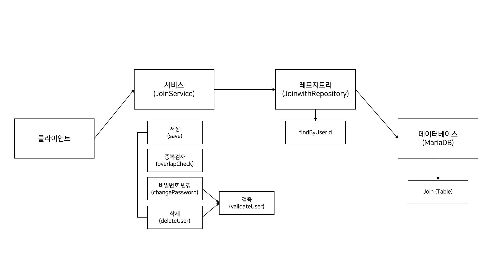

# Kotlin_Joinwith

회원가입(관리)를 위한 API 서비스

## 개발환경
* Ubuntu 20.04.2 LTS
* Intellij Community

## 기능
* 회원가입을 위한 CRUD 기능
* 특정 컬럼(비밀번호)에 대한 암호화 진행
* Junit을 활용한 테스트 코드 작성
* API 문서화를 위해 Swagger2 적용

## 구조

### JoinService
* 저장
  * 아이디, 비밀번호, 사용자 이름 등 기본적인 정보를 DB에 저장 (회원 가입)
* 중복검사
  * 아이디를 토대로 DB 내에 동일한 아이디를 사용하고 있는지 확인
* 비밀번호 변경
  * 아이디, 현재 비밀번호 그리고 변경할 비밀번호를 입력받아 검증 후 비밀번호를 변경
* 삭제
  * 아이디와 비밀번호를 전달받아 DB 내에서 해당 정보 삭제

### JoinwithRepository
* findByUserId
  * DB 내 특정 ID 검색 (결과가 있다면 중복된 아이디, 없다면 사용 가능한 아이디)

### 데이터베이스
* Join
  * 사용자의 정보가 담겨있는 테이블

## Tech Stack
* Kotlin
* Spring Boot (Spring JPA, Spring Security)
* Swagger 2
* MariaDB
